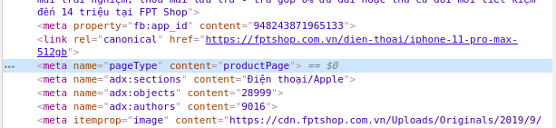
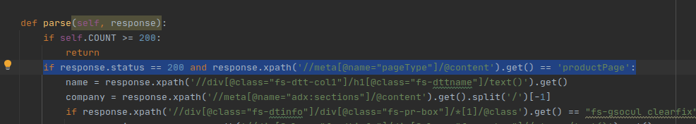
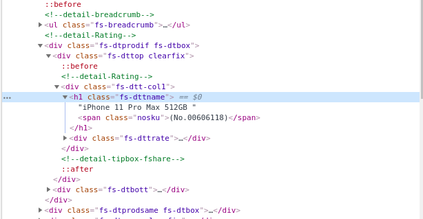
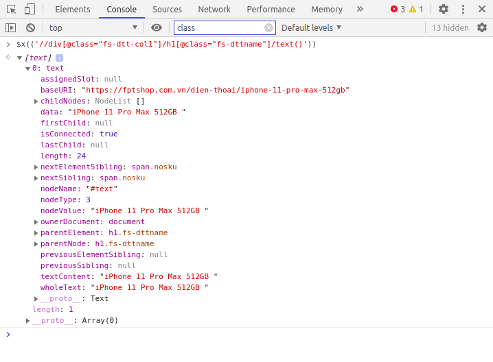
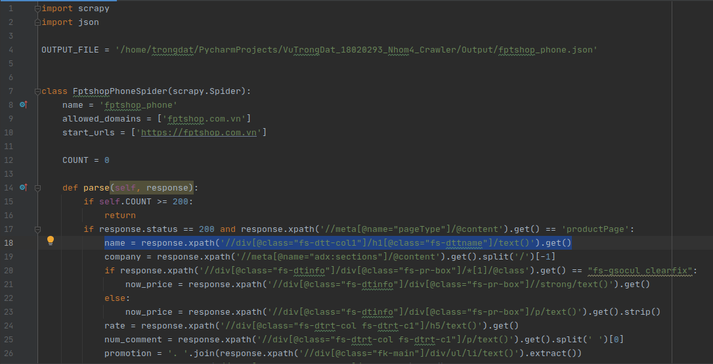
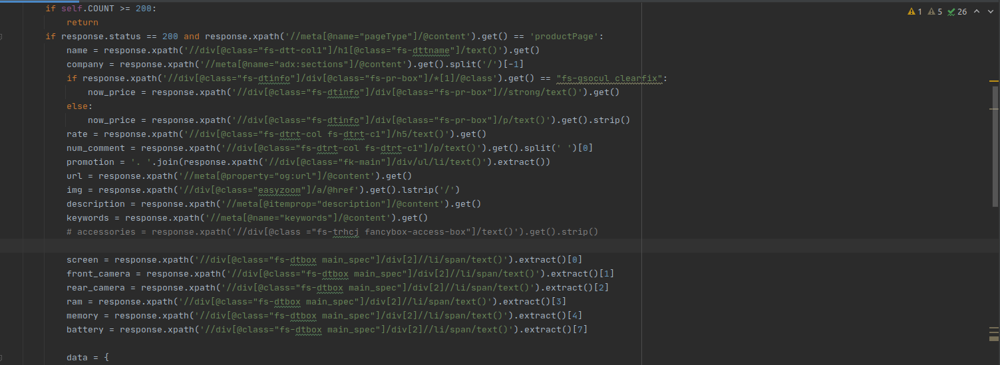
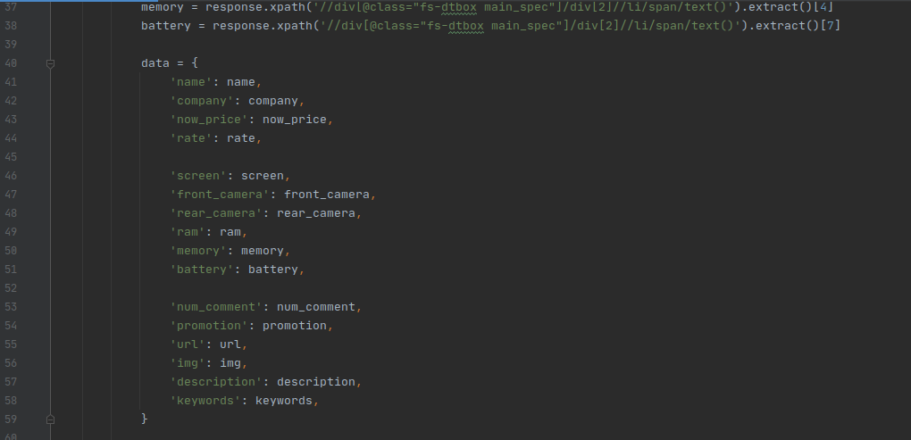
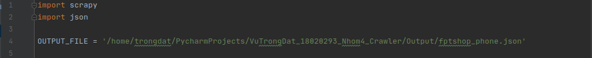
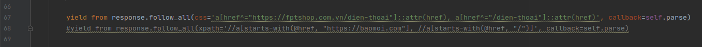
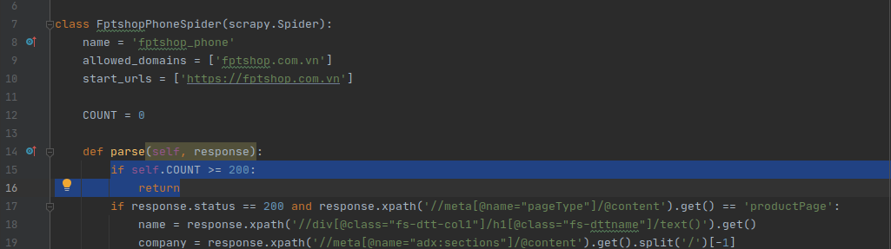

# Crawl FPTshop Phone
### Họ tên: Vũ Trọng Đạt
### MSV: 18020293

## Mục tiêu: Thu thập thông tin của 200 chiếc điện thoại trên fptshop.com.vn

##Thực hiện:
1, Tìm hiểu sơ lược trang web và tìm cách phân biệt trang thông tin sản phẩm và các loại trang khác
+ Nhận thấy chỉ các trang thông tin chi tiết về sản phẩm mới có thẻ **meta** có **name="pageType" content="productPage"**. 

+ Thêm điều kiện ràng buộc chỉ lấy thông tin của những trang có thẻ trên.

2, Trích xuất thông tin ra file
+ Tìm các thông tin cần thu thập: Sử dụng kết hợp công cụ Inspect/Console của Google Chrome.
    + Tìm kiếm phần tử cần thu thập bằng Inspect:

    + Kiểm tra bằng Console:

    + Sử dụng trong chương trình bằng Selector Xpath:

+ Các thông tin thu thập được: 
    + Tên sản phẩm.
    + Hãng sản xuất.
    + Giá bán hiện tại.
    + Điểm đánh giá.
    + Số lượt bình luận.
    + Khuyến mãi tặng kèm.
    + Đường dẫn đến sản phẩm.
    + Đường dẫn đến hình ảnh.
    + Mô tả ngắn.
    + Các từ khóa liên quan.
    + Kích thước màn hình.
    + Độ phân giải camera trước.
    + Độ phân giải camera sau.
    + Dung lượng ram.
    + Dung lượng bộ nhớ.

+ Đưa thông tin thu thập được về kiểu dữ liệu Dictionaries:

+ Ghi dữ liệu ra file .json:

3, Thêm phương thức để lan sang các sản phẩm được gợi ý trên trang đang thu thập dữ liệu

4, Thêm biến quản lý số lượng sản phẩm đã thu thập

    
